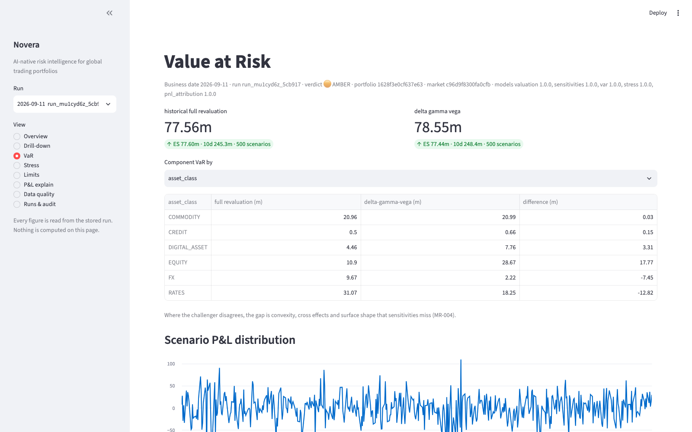
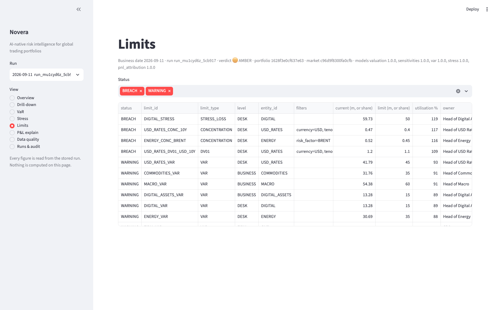
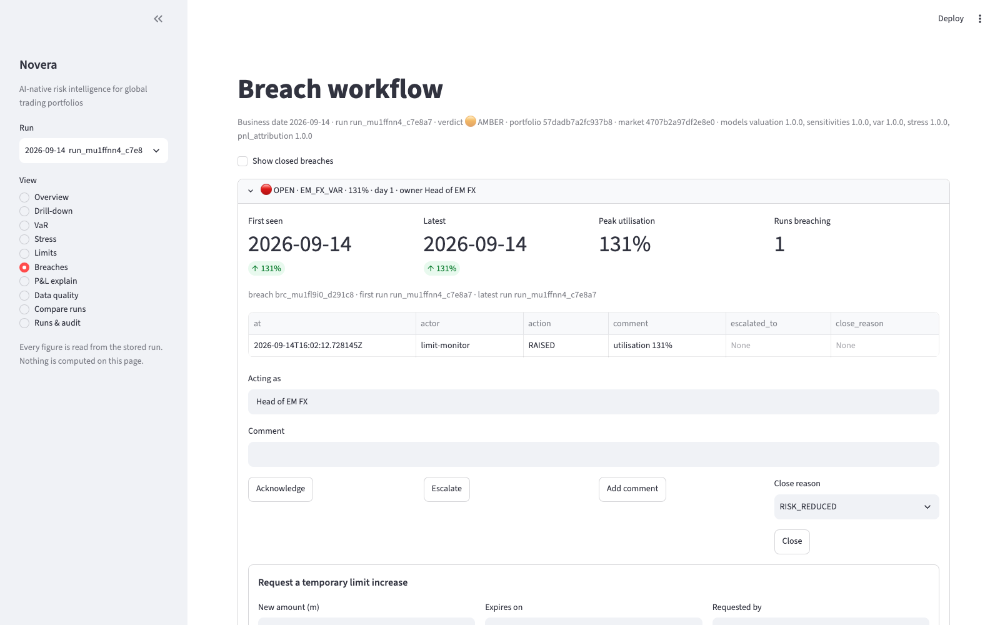
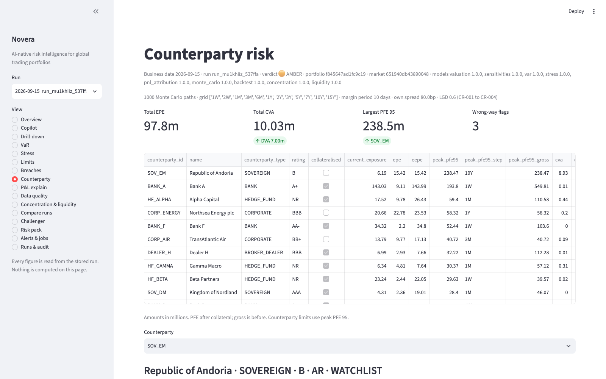
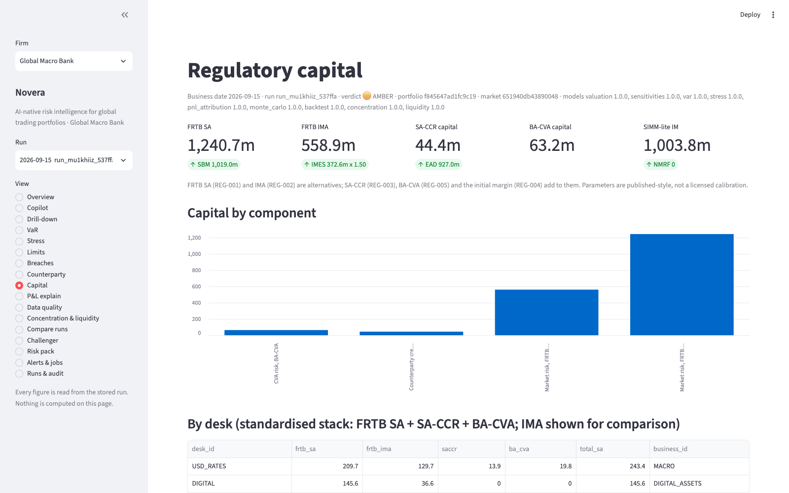
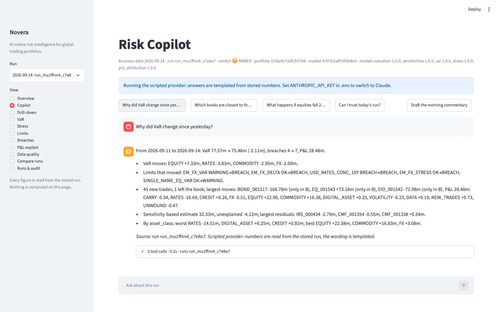

# Novera

**An AI-native market and counterparty risk platform: a deterministic risk engine, a governed daily workflow, and an AI analyst that explains the numbers but never computes them.**


Novera is a working prototype of how a modern risk function can operate. It runs an auditable
risk engine over a simulated global bank and a simulated hedge fund, then adds what most
institutions lack: automated monitoring, explanation, scenario investigation, exception
management and an assistant that answers only from validated results.

> We have enough risk numbers. The problem is turning them into decisions.


## Why it is different

- **The engine is authoritative.** No LLM ever produces, adjusts or rounds a risk number. The AI
  explains, investigates and drafts by calling tools that read stored results or run an engine what-if.
- **Every run is reproducible.** Each run records its business date, portfolio and market-data
  snapshots, model versions and config hash. Results are immutable; the same inputs give the same numbers.
- **Every metric is documented.** More than fifty methodology records cover definition, maths,
  assumptions, limitations and validation. A metric without one is not finished.
- **Models are challenged.** Pricers are benchmarked against QuantLib or closed forms, VaR has a
  challenger method, and an independent-challenger feed reconciles Novera against a second system.

## What it covers

| Area | What you get |
|---|---|
| **Market risk** | Sensitivities (DV01, CS01, Greeks), historical VaR with full revaluation, delta-gamma-vega and Monte Carlo variants, expected shortfall, stressed and weighted VaR, backtesting (Kupiec, Christoffersen), a stress library, P&L explain |
| **Counterparty risk** | Monte Carlo exposure profiles (EE, PFE), CSA collateral with an instant terms what-if, CVA and DVA, wrong-way risk, PFE-based limits |
| **Bank capital** | FRTB standardised and internal models, SA-CCR, SIMM-lite initial margin, BA-CVA, funding cash ladder |
| **Hedge fund face** | Leverage, prime-broker margin, factor betas, redemption stress, strategy attribution, crowding, fund look-through |
| **Control** | 79 seeded limits, breach workflow with auto-escalation, an approval matrix for temporary increases, per-metric sign-off and release |
| **Data quality** | A verdict on whether today's run can be trusted, with proxies and an audit trail for stale or missing market data |
| **Novera Analyst** | Plain-language questions answered from stored results, every answer logged with its tool calls |
| **Agents** | Breach investigation, scenario suggestion, model-validation drafting, CSA term-sheet ingestion with human review |
| **Operations** | In-process scheduler, partial stage re-runs, alerts to Slack or email, daily risk pack in HTML, PDF and Excel |
| **Portfolio Lab** | Plant problems at a chosen size in a sandbox and see what the platform detects |

The simulated bank has 3 legal entities, 14 desks, 38 books, 30 counterparties and about 1,500
trades across nineteen products, with roughly 1,500 risk factors and five years of correlated
daily history. The hedge fund is a second organisation with strategies, prime brokers, NAV and investors.

## Screenshots

| | |
|---|---|
|  |  |
|  |  |
|  |  |

## Quick start

You need [uv](https://docs.astral.sh/uv/) and Python 3.11 or later.

```bash
git clone https://github.com/Adamdebb/novera-risk.git
cd novera-risk
uv sync --all-extras

uv run novera simulate                                     # build the bank, portfolio and market data (~10s)
uv run novera run eod --business-date 2026-09-11           # day 1: four planted breaches (~2 minutes)
uv run novera run eod --business-date 2026-09-14           # day 2: unacknowledged breaches auto-escalate
uv run novera breach list
uv run novera ask "Why did VaR change since yesterday?"

uv run streamlit run src/novera/ui/app.py                  # morning dashboard
uv run uvicorn novera.api.app:app --reload                 # read API, docs at /docs
```

The assistant works out of the box through a scripted provider. For a real model, copy
`.env.example` to `.env` and set `GEMINI_API_KEY` (free tier), `ANTHROPIC_API_KEY`, or a Groq,
OpenRouter or local Ollama setting. `NOVERA_LLM_PROVIDER` accepts a comma-separated fallback chain.

More commands, in the same style:

```bash
uv run novera simulate --template hedge_fund && uv run novera run eod --fund   # the hedge fund face
uv run novera run counterparty      # exposure, collateral, CVA, wrong-way on the latest run
uv run novera run regulatory        # FRTB, SA-CCR, SIMM, BA-CVA, cash ladder
uv run novera report                # daily risk pack: HTML, PDF, Excel in data/reports
uv run novera signoff status        # sign-off and release of the run's metrics
uv run novera mcp                   # MCP server for Claude Desktop, Claude Code or any MCP client
uv run novera --help                # everything else
```

Alerts are stored always and delivered only when Slack or SMTP is configured. Leave them
unconfigured while you explore, because a full EOD run delivers for real once they are set.
The full test suite takes about 20 minutes (`uv run pytest`).

## Architecture

```
simulation ─▶ market_data ─▶ pricing ─▶ risk / counterparty_risk / regulatory / fund
                                              │
              limits · data_quality ◀─────────┤
                                              ▼
                      workflows (governed EOD run, audit events)
                                              │
                                  storage (DuckDB, all SQL here)
                                              │
                          api (FastAPI) ─▶ ui (Streamlit) · ai (Analyst, agents, MCP)
```

The UI holds no business logic and only calls the API or the service layer. Only the storage
layer writes SQL. The API is a contract: every route has a response model and every error is a
problem document with a stable code. See [`docs/02-architecture.md`](docs/02-architecture.md).

## Documentation

- [`docs/01-product-vision.md`](docs/01-product-vision.md): positioning, audiences, claims we make and avoid
- [`docs/02-architecture.md`](docs/02-architecture.md): layers, module map, boundaries
- [`docs/03-roadmap.md`](docs/03-roadmap.md): phases and instrument scope
- [`docs/04-governance.md`](docs/04-governance.md): methodology records, run reproducibility, AI rules
- [`docs/05-demo-script.md`](docs/05-demo-script.md): the 10-minute executive demo
- [`docs/07-eod-workflow.md`](docs/07-eod-workflow.md): the end-of-day run, step by step
- [`docs/06-decision-log.md`](docs/06-decision-log.md): every design question, the options, the choice made
- [`docs/methodology/`](docs/methodology): one record per metric
- [`docs/adr/`](docs/adr): architecture decision records

## Status

Phases 1 to 7 of the roadmap are delivered. Market data is synthetic by default, with adapters
for real data (FRED, Yahoo, Coinbase) available. Novera is a demonstration prototype, not
production risk software, and the simulated organisations and numbers are not real.

## Design principles

1. Deterministic engine, AI on top. No LLM produces an official number.
2. One workflow end to end before breadth. A product is added only when the whole pipeline already works for it.
3. Reproducible runs. Same inputs, same run lineage, same numbers.
4. Vendor neutral. Built to ingest results from other engines and reconcile them.

## Licence

[MIT](LICENSE) © 2026 Adamdebb
