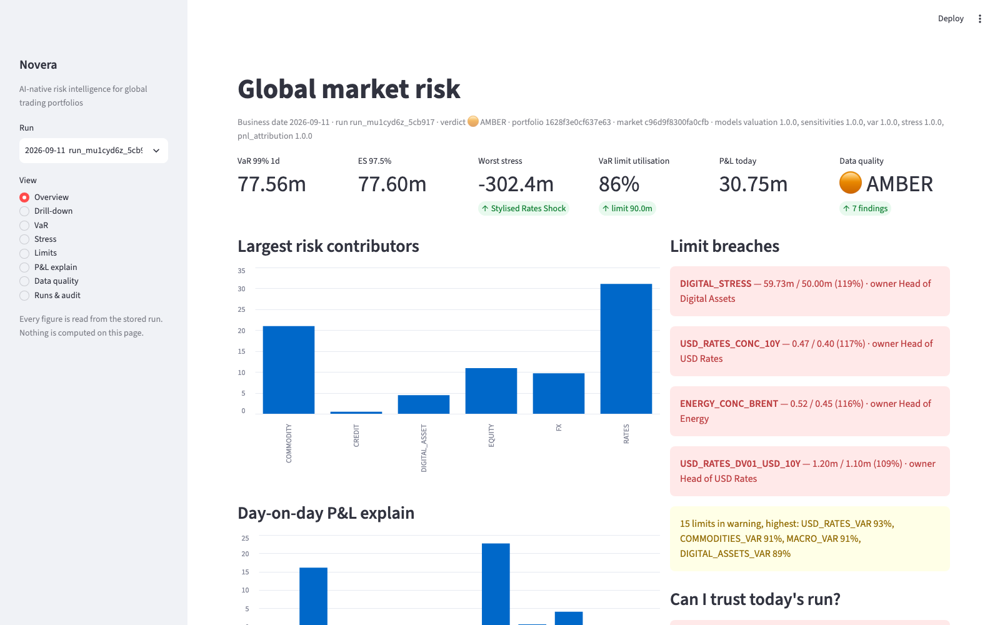

# Novera

**AI-native risk intelligence layer for global trading portfolios.**

Novera is a working prototype of how a modern market and counterparty risk function can
operate. It runs a deterministic, auditable risk engine over a simulated multi-asset
trading organisation, then adds the layer most institutions lack: automated monitoring,
explanation, scenario investigation, exception management and an AI Risk Copilot that
works only from validated numbers.

> We have enough risk numbers. The problem is turning them into decisions.

## What it does

| Capability          | What the platform answers                                   |
|---------------------|-------------------------------------------------------------|
| Aggregation         | What do we hold, what is it worth, at every hierarchy level |
| Monitoring          | What changed since yesterday                                |
| Investigation       | Why it changed: market move, new trades, model, data        |
| Simulation          | What happens under historical and hypothetical stress       |
| Control             | Which limits are breached, who owns them, what happens next |
| Intelligence        | Which risks matter most today                               |
| Copilot             | Ask the platform in plain language, get sourced answers     |

Individual measures such as VaR, expected shortfall, Greeks, DV01, CS01, PFE and CVA are
components that serve those capabilities.

## Status

Phases 1 to 7 delivered. See `docs/03-roadmap.md`.

- Simulated bank: 3 legal entities, 14 desks, 38 books, 30 counterparties, ~1,500 trades
  across nineteen products (bonds, swaps, repos, rates futures, swaptions, FX spot,
  forwards and options, cash equity, index futures, equity options, barrier and digital
  options, ETFs and mutual funds, commodity futures and options, CDS indices and single
  names, crypto), ~1,400 risk factors with three years of correlated daily history.
- Pricing written in Python and benchmarked against QuantLib, with a model inventory that
  rates each product's model against the market standard and measures the gap where one
  exists; sensitivities, historical VaR with a challenger, stress library, 79 seeded limits,
  P&L explain, data-quality verdict.
- A governed end-of-day run stored with its run id, snapshot ids, model versions and
  audit events. A FastAPI API and a Streamlit morning dashboard over the stored run.
- Breach workflow with auto-escalation and an approval matrix for temporary limit
  increases, and run-to-run comparison. Two simulated business days out of the box.
- Risk Copilot: ask questions in plain language, get answers built only from stored run
  results and engine what-ifs, every answer recorded with its tool calls. Works without
  an API key through a scripted provider; set `ANTHROPIC_API_KEY` for Claude.
- Three VaR methods (historical full revaluation, delta-gamma-vega challenger, Monte
  Carlo), backtesting with Kupiec and Christoffersen tests, concentration and liquidity
  measures, and a daily risk pack in HTML, PDF and Excel.
- Counterparty risk: Monte Carlo exposure profiles with full revaluation, CSA collateral
  with an instant what-if on terms, CVA and DVA, wrong-way indicators, PFE-based limits.
- Bank capital: FRTB standardised and internal models, SA-CCR, SIMM-lite initial
  margin, BA-CVA, a funding cash ladder, capital by desk.
- Hedge-fund face: a second simulated organisation with strategies, prime brokers, NAV and
  investors; leverage, broker margin, factor betas, redemption stress, strategy
  attribution and crowding.
- Instrument breadth: every product priced by a benchmarked closed form (QuantLib or
  analytic), funds seen through to their constituents, and stale or missing market data
  proxied before pricing with an audit trail that travels with the run.
- Agents: breach investigation (evidence and an engine-sized remediation attached to the
  breach), scenario suggestion (sized by the history, run through the engine), model
  validation drafting from the methodology records, and CSA term-sheet ingestion with a
  review step. Portfolio Lab: plant problems at a chosen size in a sandbox and see what
  the platform detects. An MCP server exposes the same tools to Claude Desktop, Claude
  Code or any MCP client, read-only by default, every call audited.
- Operations: a scheduler that advances the simulated world and runs EOD with retries,
  alerts to Slack or email, an independent-challenger reconciliation that attributes the
  gap to a second risk system, and adapters for real market data (FRED, Yahoo, Coinbase).

## Morning dashboard



## Quick start

```bash
uv sync --all-extras
uv run pytest                      # ~2 minutes
uv run novera simulate             # build the bank, portfolio and market data (~10s)
uv run novera run eod --business-date 2026-09-11   # day 1: the four planted breaches (~2 minutes)
uv run novera run eod --business-date 2026-09-14   # day 2: unacknowledged breaches auto-escalate
uv run novera breach list
uv run novera ask "Why did VaR change since yesterday?"
uv run novera schedule --once      # advance one business day and run EOD, with alerts
uv run novera vendor-feed && uv run novera reconcile data/feeds/official_risk_2026-09-15.csv
uv run novera run counterparty     # exposure, collateral, CVA, wrong-way on the latest run (~3 minutes)
uv run novera run regulatory       # FRTB, SA-CCR, SIMM, BA-CVA, cash ladder on the latest run
uv run novera simulate --template hedge_fund && uv run novera run eod --fund   # the fund face
uv run novera report               # daily risk pack: HTML, PDF, Excel in data/reports
uv run novera fetch --sources yahoo,coinbase --start 2019-01-01   # optional, needs network
uv run streamlit run src/novera/ui/app.py           # morning dashboard
uv run uvicorn novera.api.app:app --reload          # read API, docs at /docs
```

The dashboard reads the stored run in-process by default. Set `NOVERA_API_URL=http://127.0.0.1:8000`
to make it call the API instead.

## Documentation

- `docs/01-product-vision.md` — positioning, audiences, claims we make and avoid
- `docs/02-architecture.md` — layers, module map, boundaries
- `docs/03-roadmap.md` — phases and instrument scope
- `docs/04-governance.md` — methodology records, run reproducibility, AI rules
- `docs/05-demo-script.md` — the 10-minute executive demo
- `docs/06-decision-log.md` — every design question, the options, the choice made, and what to revisit
- `docs/adr/` — architecture decision records
- `docs/methodology/` — one record per metric

## Design principles

1. Deterministic engine, AI on top. No LLM produces an official number.
2. One workflow end to end before breadth. Products are added only when the full
   pipeline (capture, valuation, sensitivities, VaR, stress, limits, report) already works.
3. Reproducible runs. Same inputs, same run ID lineage, same numbers.
4. Vendor neutral. Designed to ingest results from other engines and reconcile them.

## Licence

Proprietary. All rights reserved.
